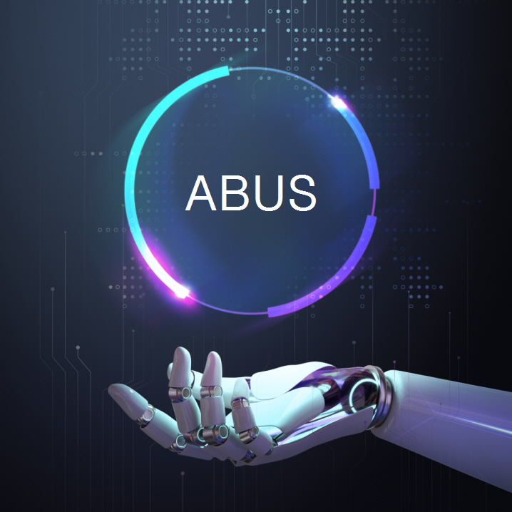

# ABUS One-Click

🌍 [한국어](README.kor.md) ∙ [English](README.eng.md) ∙ [日本語](README.jpn.md)

## Introduction
[ABUS](https://slashpage.com/abus) provides the latest AI tools with one click.
We have the technology to install and run OpenAI's voice recognition & translation engine Whisper and Facebook Research's Demucs with one click.
With ABUS One-Click, you can easily use the latest AI tools such as voice recognition, translation, voice synthesis, and vocal removal on your PC with one click, without complicated procedures such as system setup and model selection. Experience the latest AI technology faster than anyone else with ABUS One-Click.

ABUS One-Click Studio offers:
* Supports system setup, installation, execution, and deletion processes with `One-Click`
* 4-Tab interface
  * `Studio` Tab: YouTube downloader, vocal removal, automatic subtitle integrated environment
  * `Downloader` Tab: Download YouTube videos (mp4, webm). Supports image quality selection (low, good, best)
  * `Splitter` Tab: Vocal removal, Karaoke vidoe production. Supports 4 models of Demucs (htdemucs, htdemucs_ft, htdemucs_6s, mdx_extra). Supports 3 audio outputs (wav, flac, mp3)
  * `Subtitle` Tab: Voice recognition, automatic translation, automatic subtitles (srt, vtt, txt)

## Key-Features
* Use **yt-dlp** to download YouTube videos.
* You can download YouTube videos (mp4, webm) and save them as audio files (mp3, wav, flac).
* Provides **Demucs**, a music source separation AI of Facebook Research.
* Provides **Whisper**, a high-performance STT AI of OpenAI.
* Once installed, it can be used permanently at no additional cost. ( ※ Free version has a **30-minute** usage time limit)
* Provides a Gradio Web-UI. I recommend the Google Chrome browser.
* Supports over 90 languages including Japanese, Korean, English, Chinese, French and Spanish.

## Running Environment
* OS : Windows 10/11 **※ Linux, Mac OS is not supported.**
* CPU: Intel Processor 2GHz or faster (or equivalent compatible)
* RAM: 4GB or greater
* HDD: At least 10GB of free space during installation
* GPU: NVIDIA graphics card supporting CUDA 11.8 is recommended
* Internet connection required (installation)

## How to run
1. Run `configure.bat`: Install python, git, ffmpeg, and CUDA (if using NVIDIA GPU) on Windows.
2. Run `install.bat`: Create a venv folder and prepare the virtual environment. Install ABUS One-Click in the virtual environment.
3. Run `start.bat`: Internet Browser (Chrome) will automatically run. Run Web-UI for ABUS One-Click.
4. Run `uninstall.bat`: Removes the installed virtual environment. Remove python, git, ffmepg, and CUDA packages installed on Windows (if selected)

## caution
When Windows Defender mistakenly recognizes a batch file as a Trojan, this is often called a 'False Positive'. To solve this problem, you can go through the following steps:

1. File exception handling: In Windows Defender, you can set certain files or processes to skip security scanning. To do this, follow the steps below:
   * Click the ‘Start’ button and go to ‘Settings’.
   * Click ‘Update & Security’.
   * Select ‘Windows Security’ and go to ‘Virus & threat protection’.
   * Click ‘Manage Virus & Threat Protection Settings’.
   * Select 'Add exception' in 'Virus & threat protection settings'.
   * Select 'File or Folder', find the batch file in question and add it as an exception.
2. Temporarily disable Windows Defender: This may be a temporary solution. However, you must be careful when using this method as it may expose your computer to other threats.
3. Report the problem to anti-virus software: If you are sure that the file is not a Trojan horse, you can report it to Microsoft as a False Positive. Microsoft will review this and take any necessary action.

## Contact us
* e-mail: <abus.aikorea@gmail.com>
* homepage(Korean): <https://slashpage.com/abus>
* 네이버 스마트스토어(korean): <https://smartstore.naver.com/abus/category/ALL?cp=1>
* Coupang(Korean): <https://www.coupang.com/vp/products/7875503674>
* Amazon(US): <https://www.amazon.com/dp/B0CTQQDPXT>
* Amazon(Japan): <https://www.amazon.co.jp/dp/B0CTHT2JH3>

## YouTube
* Product Information: <https://youtu.be/heEN4UIQLjc>
* Automatic Subtitle∙Translation: <https://youtu.be/uQ14hoEiI4c?si=Io9K_vIDYyeu9Z8_>
* Home Karaoke: <https://youtube.com/playlist?list=PLwx5dnMDVC9bVxfGo58U-R-w3fUHqwiD6&si=TZBh5AFjcr7_dyiI>
  

## Copyright
 by [ABUS](https://slashpage.com/abus)