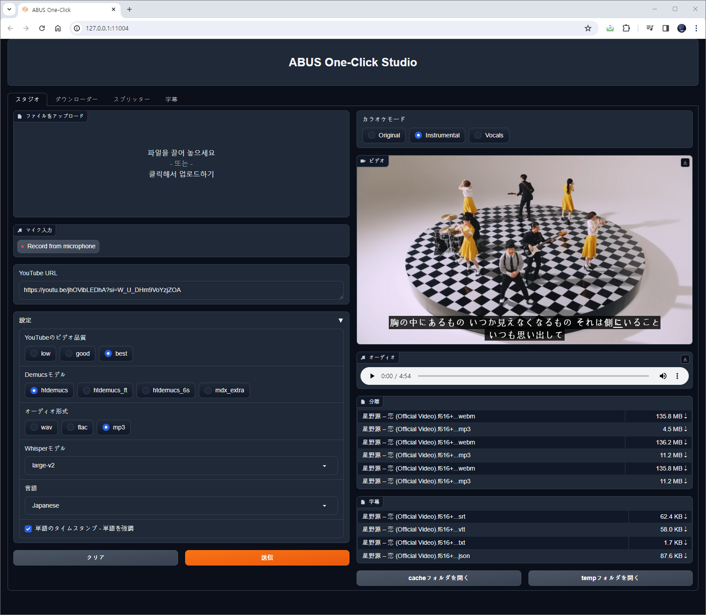
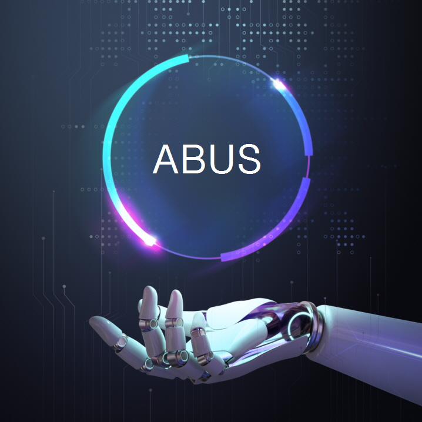

# ABUS One-Click

🌍 [한국어](README.kor.md) ∙ [English](README.eng.md) ∙ [日本語](README.jpn.md)

[](LICENSE)
[](https://github.com/abus-aikorea/studio-free/releases)


## はじめに
最新のAIツールをワンクリックで提供する[ABUS](https://slashpage.com/abus)です。
私たちはOpenAIの音声認識＆翻訳エンジンであるWhisperとFacebook ResearchのDemucsをワンクリックでインストール＆駆動する技術を持っています。
ABUS One-Clickを使用すると、システム設定、モデル選択などの複雑な手順なしに、音声認識、翻訳、音声合成、ボーカル除去などの最新のAIツールをワンクリックで自分のPCで簡単に利用できます。 ABUS One-Clickで、誰よりも早く最新のAI技術に出会えます。

ABUS One-Click Studioが提供する機能：
* システム設定、インストール、実行、削除プロセスを `One-Click` でサポート
* 4つのタブ
  * `スタジオ` タブ: YouTubeダウンローダ、ボーカル削除、自動字幕統合環境
  * `ダウンローダー` タブ: YouTubeビデオダウンロード（mp4、webm）。画質選択(low,good,best)サポート
  * `スプリッター` タブ: ボーカル除去、MR制作。 Demucsの4つのモデル（htdemucs、htdemucs_ft、htdemucs_6s、mdx_extra）をサポート。 3つのオーディオ出力（wav、flac、mp3）をサポート
  * `字幕` タブ: 音声認識、自動翻訳、自動字幕（srt、vtt、txt）





## 主な特長
* YouTubeビデオのダウンロードには**yt-dlp**を使用してください。
* YouTube動画（mp4、webm）をダウンロードし、オーディオファイル（MP3、wav、flac）として保存することもできます。
* Facebook Researchの音源分離(music source separation)システムのDemucsを提供します。
* OpenAIの高性能文字起こしAI「Whisper」を提供します。
* 一度設置すれば、追加費用なしで**永続的**に使用することができます。 ( ※ Free版は利用時間**30分制限**あり)
* **Gradio Web-UI**を提供します。 Google Chrome ブラウザをお勧めします。
* 日本語、韓国語、英語、中国語、フランス語、スペイン語など90余りの言語に対応しています。


## 商品説明文
* OS : Windows 10/11 **※ Linux, Mac OSには対応しておりません。**
* CPU: Intelプロセッサ 2GHz以上(または同等の互換プロセッサ)
* RAM: 4GB 以上
* HDD: 10GB以上の空き容量(インストール時)
* GPU: :CUDA 11.8に対応するNVIDIAグラフィックカードを推奨
* インターネット接続環境必須(インストール時)


## インストールと実行

### step 1. パッケージの準備
* A.有料バージョン
    + USBに含まれる圧縮ファイル（**abus-studio-v2.x.x.zip**）をコンピュータの適切な場所に解凍する
    + またはすでに解凍されているフォルダ（**abus-studio-v2.x.x**）をコンピュータの適切な場所にコピーする

* B. 無料版
  + [](https://github.com/abus-aikorea/studio-free/releases) から最新リリース (**Source code (zip)**) ダウンロード後に解凍
  + または、git cloneでソースコードをダウンロードする

```bash
git clone https://github.com/abus-aikorea/studio-free.git
```

## step 2. インストールして実行する方法
1. `configure.bat`の実行： Windowsにpython、git、ffmpeg、CUDA（NVIDIA GPUを使用している場合）をインストールします。
2. `install.bat`の実行： venvフォルダを作成し、仮想環境を準備します。仮想環境にABUS One-Clickをインストールします。
3. `start.bat` 実行: 自動的に Internet Browser (Chrome) が実行されます。 ABUS One-Click 用の Web-UI を実行します。
   * Browserが自動的に実行されない場合
     * Windows-Commnadウィンドウを終了し、start.batを再実行するか、
     * Browserを直接実行し、Windows-Commnadウィンドウに表示されたアドレス（例：http://127.0.0.1:11004）をアドレスウィンドウに入力します。
4. `uninstall.bat`の実行： インストールされている仮想環境を削除します。 Windowsにインストールしたpython、git、ffmepg、CUDAパッケージを削除します（選択した場合）


## 注意事項
Windows Defenderが誤ってバッチファイルをトロイの木馬として認識している場合、これはしばしば「False Positive」と呼ばれます。この問題を解決するには、次の手順を実行できます。

1. ファイル例外処理：Windows Defenderでは、特定のファイルまたはプロセスがセキュリティチェックをスキップするように設定できます。これを行うには、以下の手順に従ってください

   * 「スタート」ボタンをクリックして「設定」に進みます。
   * [アップデートとセキュリティ]をクリックしてください。
   * 「Windowsセキュリティ」を選択し、「ウイルスと脅威の保護」に進みます。
   * [ウイルスと脅威の保護設定の管理]をクリックしてください。
   * 「ウイルスと脅威の保護設定」で「例外を追加」を選択してください。
   * 「ファイルまたはフォルダ」を選択し、問題のバッチファイルを見つけて例外として追加します。
2.  Windows Defender をしばらく無効にする: この方法は一時的な解決策になります。ただし、この方法を使用すると、コンピュータが他の脅威にさらされる可能性があるため、注意が必要です。

3. ワクチンソフトウェアに問題を提起: ファイルがトロイの木馬ではないという確信があれば、マイクロソフトに False Positive として情報を提供できます。マイクロソフトはこれを確認した後、必要な措置を講じます。


## 製品お問い合わせ
* メール: <abus.aikorea@gmail.com>
* ホームページ(韓国語): <https://slashpage.com/abus>
* 네이버 스마트스토어(韓国語): <https://smartstore.naver.com/abus/category/ALL?cp=1>
* Coupang(韓国語): <https://www.coupang.com/vp/products/7875503674>
* Amazon(英語): <https://www.amazon.com/dp/B0CTQQDPXT>
* Amazon(日本語): <https://www.amazon.co.jp/dp/B0CTHT2JH3>


## YouTube
* 商品説明: <https://youtu.be/heEN4UIQLjc>
* 自動字幕・翻訳: <https://youtu.be/uQ14hoEiI4c?si=Io9K_vIDYyeu9Z8_>
* ホームカラオケ: <https://youtube.com/playlist?list=PLwx5dnMDVC9bd6y3wXs-bOas2cXIi-GAq&si=B4S8HJr8gmeAw8hw>
  


## 著作権
 by [ABUS](https://slashpage.com/abus)