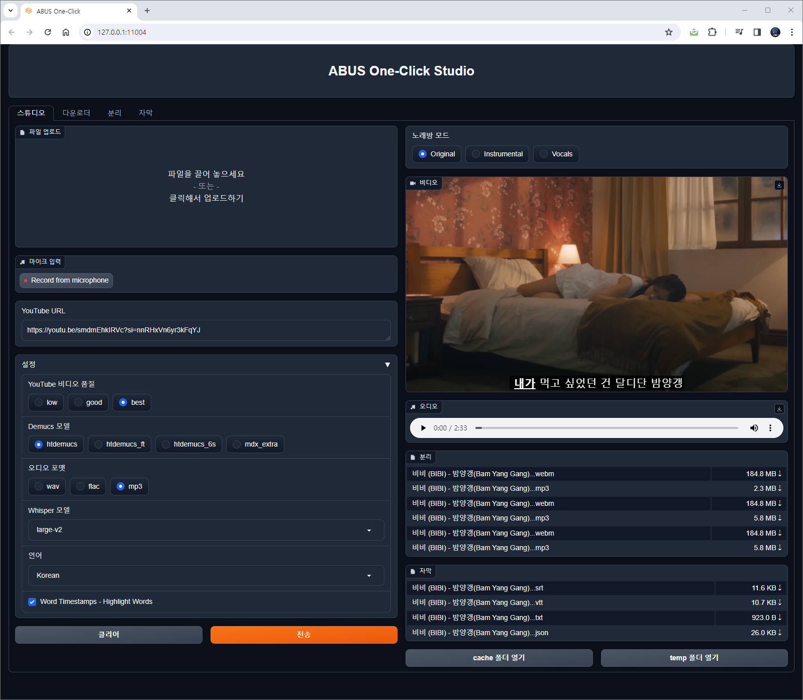

# ABUS One-Click

🌍 [한국어](README.kor.md) ∙ [English](README.eng.md) ∙ [日本語](README.jpn.md)

[](LICENSE)
[](https://github.com/abus-aikorea/studio-free/releases)


## 소개
최신의 AI 도구들을 원클릭으로 제공하는 [ABUS(에이버스)](https://slashpage.com/abus)입니다.
저희는 OpenAI의 음성인식 & 번역 엔진인 Whisper 와 Facebook Research 의 Demucs 를 원클릭으로 설치 & 구동할 수 있는 기술을 보유하고 있습니다. 
ABUS One-Click 을 이용하시면 시스템 설정, 모델 선택 등의 복잡한 절차 없이, 음성 인식, 번역, 음성합성, 보컬제거 와 같은 최신의 AI 도구들을 원클릭으로 내 PC 에서 손쉽게 이용해 볼 수 있습니다. ABUS One-Click 으로 누구보다 빨리 최신의 AI 기술을 만나 보세요. 

ABUS One-Click Studio 가 제공하는 기능:
* 시스템 설정, 설치, 실행, 삭제 과정을 `One-Click` 으로 지원
* 4개의 탭 인터페이스
  * `스튜디오` 탭: YouTube 다운로더, 보컬제거, 자동자막 통합환경
  * `다운로더` 탭: YouTube 영상 다운로드(mp4, webm). 화질선택(low,good,best) 지원
  * `분리` 탭: 보컬제거, MR제작. Demucs의 4가지 모델(htdemucs, htdemucs_ft, htdemucs_6s, mdx_extra) 지원. 3가지 오디오 출력(wav, flac, mp3) 지원
  * `자막` 탭: 음성인식, 자동번역, 자동자막(srt, vtt, txt)





## 주요특징
* YouTube 영상 다운로드를 위해 **yt-dlp**를 사용합니다. 
* YouTube 동영상(mp4, webm)을 다운로드하고, 오디오 파일(MP3, wav, flac)로도 저장할 수 있습니다.
* Facebook Research 의 Music Source Separation 엔진, **Demucs**를 제공합니다.
* OpenAI의 고성능 음성인식 엔진, **Whisper**를 제공합니다.
* 한 번 설치하면 추가 비용 없이 **영구적**으로 사용할 수 있습니다. ( ※ Free버전은 이용시간 **30분제한** 있음)
* **Gradio Web-UI**를 제공합니다. Google Chrome 브라우저를 권장합니다.
* 일본어, 한국어, 영어, 중국어, 프랑스어, 스페인어 등 90개 이상의 언어를 지원합니다.


## 실행 환경
* OS : Windows 10/11 **※ Linux, Mac OS는 지원하지 않습니다.**
* CPU: Intel 프로세서 2GHz 이상(또는 동급 호환)
* RAM: 4GB 이상
* HDD: 설치 중 최소 10GB의 여유 공간
* GPU: CUDA 11.8을 지원하는 **NVIDIA** 그래픽 카드 권장
* 인터넷 연결 필요(설치시)


## 설치 와 실행

### step 1. 패키지 준비
* A. 유료버전
    + USB에 포함된 압축파일(**abus-studio-v2.x.x.zip**)을 컴퓨터의 적당한 위치에 압축해제
    + 혹은, 이미 압축이 해제된 폴더(**abus-studio-v2.x.x**)를 컴퓨터의 적당한 위치에 복사

* B. 무료버전
  + [](https://github.com/abus-aikorea/studio-free/releases) 로부터 최신 릴리즈 (**Source code (zip)**) 다운로드 후 압축 해제 
  + 혹은, git clone 으로 소스코드 다운로드
    
```bash
git clone https://github.com/abus-aikorea/studio-free.git
```

### step 2. 프로그램 설치 및 실행
1. `configure.bat` 실행: Windows에 python, git, ffmpeg, CUDA(NVIDIA GPU를 사용하는 경우) 를 설치합니다.
2. `install.bat` 실행: venv 폴더를 만들고 가상환경을 준비합니다. 가상환경에 ABUS One-Click 을 설치합니다.
3. `start.bat` 실행: 자동으로 Internet Browser (Chrome)가 실행 됩니다. ABUS One-Click 을 위한 Web-UI 를 실행합니다. 
  * Browser가 자동으로 실행되지 않는 경우
    * Windows-Commnad 창을 종료하고, start.bat 을 다시 실행하거나
    * Browser를 직접 실행하고, Windows-Command 창에 표시된 주소(예, **http://127.0.0.1:11004** )를 주소창에 입력합니다.
4. `uninstall.bat` 실행: 설치된 가상환경을 제거합니다. Windows 에 설치한 python, git, ffmepg, CUDA 패키지를 제거합니다(선택할 경우)

## 주의사항
Windows Defender가 실수로 batch 파일을 트로이 목마로 인식하는 경우, 이는 종종 'False Positive'라고 불립니다. 이런 문제를 해결하기 위해서는 다음과 같은 과정을 거칠 수 있습니다.

1. 파일 예외 처리: Windows Defender에서 특정 파일이나 프로세스가 보안 검사를 건너뛰도록 설정할 수 있습니다. 이를 위해 아래의 단계를 따르세요.
   * '시작' 버튼을 클릭하고 '설정'으로 이동하세요.
   * '업데이트 및 보안'을 클릭하세요.
   * 'Windows 보안'을 선택하고 '바이러스 및 위협 보호'로 이동하세요.
   * '바이러스 및 위협 보호 설정 관리'를 클릭하세요.
   * '바이러스 및 위협 보호 설정'에서 '예외 추가'를 선택하세요.
   * '파일 또는 폴더'를 선택하고, 문제의 batch 파일을 찾아 예외로 추가하세요.
2. Windows Defender를 잠시 비활성화: 이 방법은 임시적인 해결책이 될 수 있습니다. 하지만 이 방법을 사용할 경우, 컴퓨터가 다른 위협에 노출될 수 있으므로 주의가 필요합니다.
3. 백신 소프트웨어에 문제 제보: 만약 파일이 트로이 목마가 아니라는 확신이 있다면, Microsoft에 False Positive로 제보할 수 있습니다. Microsoft는 이를 검토한 후 필요한 조치를 취할 것입니다.


## 제품 문의
* 이메일 문의: <abus.aikorea@gmail.com>
* 홈페이지: <https://slashpage.com/abus>
* 네이버 스마트스토어: <https://smartstore.naver.com/abus/category/ALL?cp=1>
* 쿠팡: <https://www.coupang.com/vp/products/7875503674>
* 아마존(미국): <https://www.amazon.com/dp/B0CTQQDPXT>
* 아마존(일본): <https://www.amazon.co.jp/dp/B0CTHT2JH3>


## YouTube
* 제품 설명: <https://youtu.be/heEN4UIQLjc>
* 자동 자막∙번역: <https://youtu.be/uQ14hoEiI4c?si=Io9K_vIDYyeu9Z8_>
* 홈 가라오케: <https://youtube.com/playlist?list=PLwx5dnMDVC9Z8kB01tQKfzTysaCCxC3C8&si=v_GLA6Edwj_AWgHg>
  


## 저작권 정보
 by [ABUS](https://slashpage.com/abus)